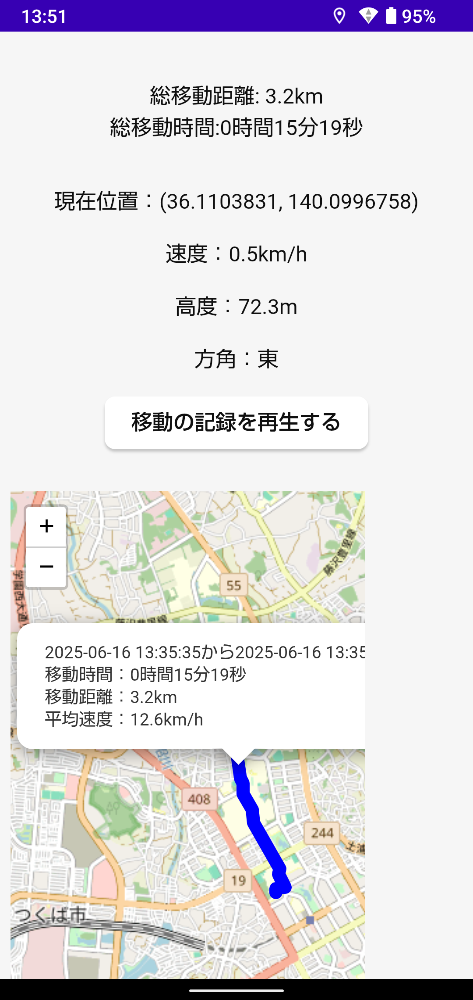
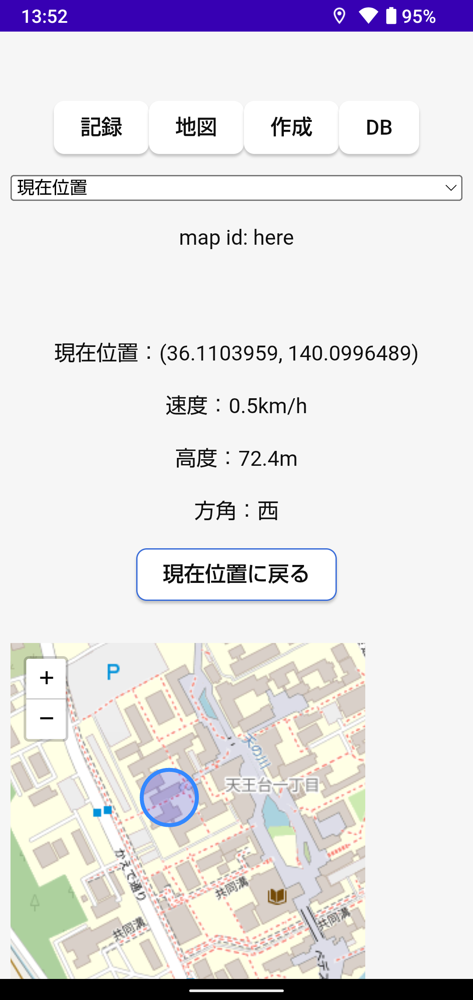

# overmove

モバイル用移動記録アプリです。

## インストール方法

まず環境構築を次のリンクに従って行います。

- Tauri: <https://v2.tauri.app/start/prerequisites/>
- Rust: <https://www.rust-lang.org/learn/get-started>
- npm: <https://www.npmjs.com/>
- Android Studioとそれに付随するSDK: <https://v2.tauri.app/start/prerequisites/#android>
- 署名用環境: <https://v2.tauri.app/ja/distribute/sign/android/>

次に、リポジトリをcloneしてビルドします。

```
git clone git@github.com:puripuri2100/overmove.git
cd overmove
npm run tauri build
```

最後に、生成されたapkファイルをAndroidのスマホに移し、インストール作業を行います。

## example

### 移動を記録している様子




### 現在位置を表示している様子


